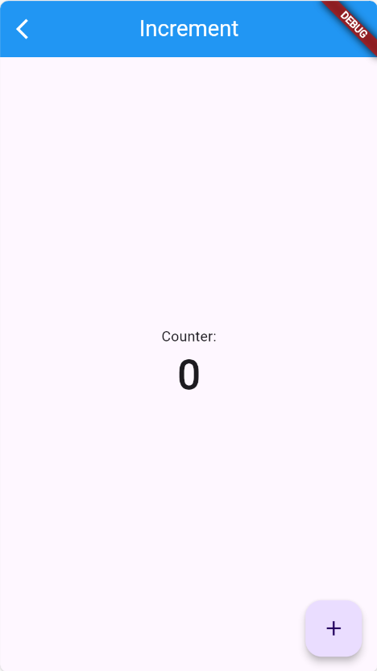

# Homework 6 - Test Driven Development

The objective for this homework practice test-driven-development (TDD). In TDD you develop your tests first and then write code to pass those tests. Here I have provided the tests for you, so your assignment is to develop code to pass the tests.

Tests are located under:
integration_test/ and test/

**Do NOT modify the tests**

All you modifications/changes will go under:
lib/screens/

you will change screen#.dart files.

the starting point for the whole application is: 
lib/main.dart

## Screen 1: Increment

Write code using the techniques learned in previous labs. You should base your code on the screenshot below and the integration tests.

The objective here is to create a counter increment app.



## Screen 2: Converter

The objective here is to create a feet to yard conveter app.


## Screen 3: Has Numbers

The objective here is to create an app to determine if an input text has numbers in it.


## Run Tests

Each time you finish writting your code for a single Screen, go ahead and run the integration test. Use the following commands to run the tests. The tests will also be run by GitHub everytime you push.

### For Codespaces

```
flutter test test/test.dart
```

### For Local Computer

```
flutter test integration_test/test.dart
```
